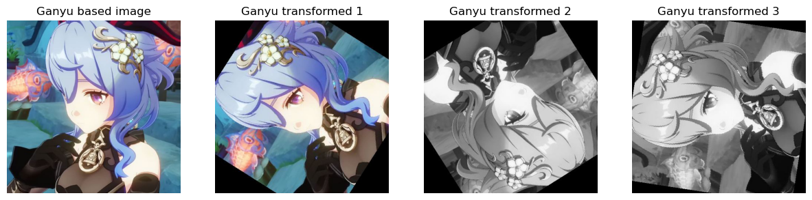
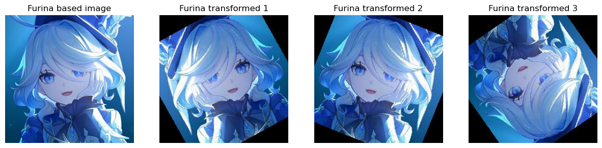
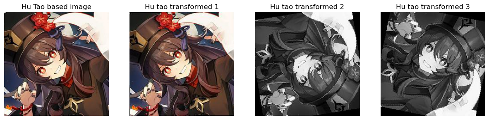
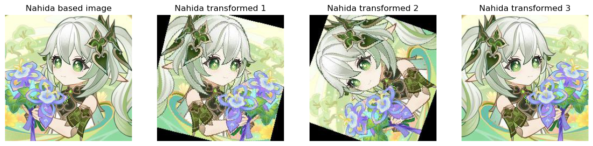
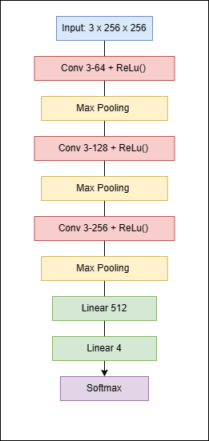
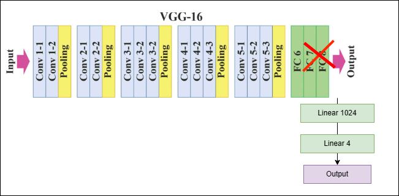
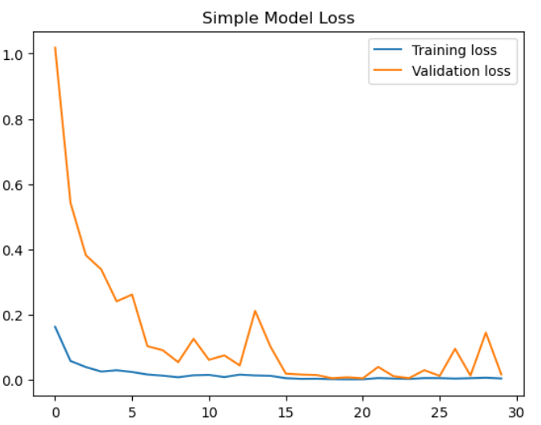
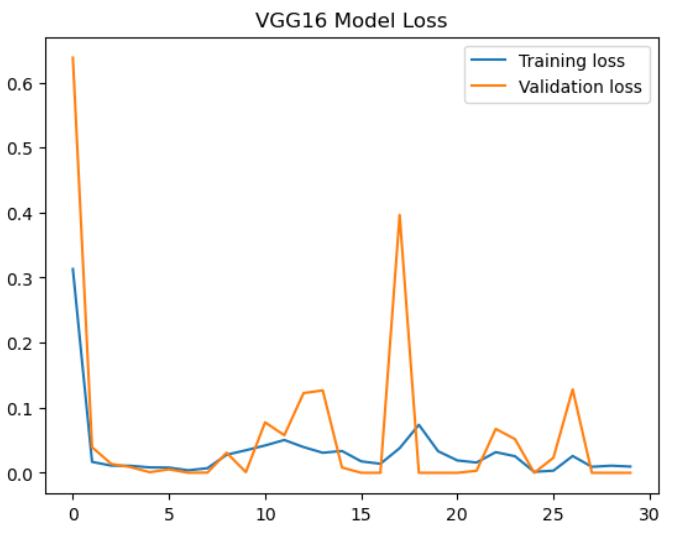

# Genshin Impact Character Classifier

This is a simple image classifier that uses a convolutional neural network on Pytorch to classify images of Genshin
Impact characters. The dataset is small and contains images only of four characters: Ganyu, Nahida, Furina, and Hu Tao.

For the classification, I will use a simple CNN and a pre-trained VGG16 model with some modifications. The dataset is
small, and the images are not very diverse, so I expect the simple CNN to perform well. The VGG16 model is a bit of an
overkill for this task, but I want to see how it performs on this dataset.

# Libraries and tools used

- Pytorch
- Numpy
- Matplotlib
- PIL
- Torchvision
- OS
- Time

# Example of data augmentation

For the dataset, I decided to use only official game arts, scenes from character trailers and screenshots from games.
Unfortunately, it is challenging to find diverse images for this task, so I will use data augmentation to increase the
diversity of the dataset.

# Simple CNN model architecture

# Modified VGG16 model architecture

# Comparison of the two models

Optimization algorithm: Adam

Loss function: CrossEntropyLoss

Learning rate: 0.001

Batch size: 15

  
  

# Results

According to additional tests, using images that are not in the dataset, both models perform well. It looks like VGG16
is slower than a simple model. However, the
VGG16 is faster in the achievement of validation loss equals to zero.

# Future development

For future work, I would like to use a larger dataset and more diverse images. I would also like to try other
pre-trained models and
compare their performance as one of the experiments.
